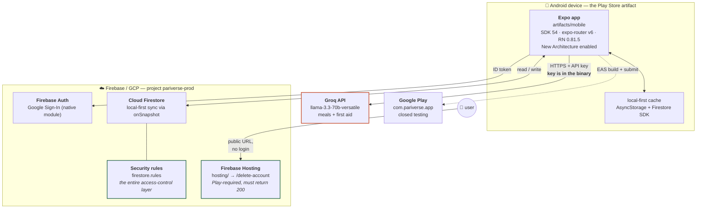
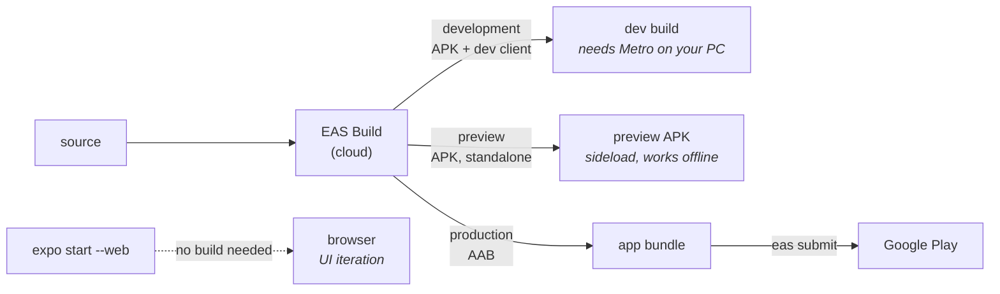

# Pariverse — architecture

Last verified against the live project on **2026-08-14**.

An Expo mobile app that talks directly to Firebase and Groq. **There is no server tier**, no
database of our own, and no API we operate. Everything below is what actually runs, verified
against the deployed project rather than inferred from the code.

---

## Runtime

**The one line version:** Expo app → Firebase Auth + Firestore (direct, local-first), and
→ Groq (direct). Nothing else.

### Why "no server" matters

With no backend, **Firestore security rules are the whole access-control layer**. There is no
server-side check behind them. A rules mistake exposes every user at once, which is why
`firestore.rules` is treated as the highest-value file in the repo.

---

## Data model

> **Two different things are called "community" — don't confuse them.**
> `users/{uid}/data/community` is *your private state* about the feed (which posts you liked,
> saved or hid) and is owner-only. `communityPosts` is **the feed itself, and it is a single
> global feed shared by every user of the app.** See [Mom's Corner is global](#moms-corner-is-a-single-global-feed).

| Path | Contents | Access |
|---|---|---|
| `users/{uid}` | profile — name, family name, email | owner only |
| `users/{uid}/data/{family\|meals}` | chores, meal plans | owner only |
| `users/{uid}/data/community` | **your own** liked / saved / hidden post ids | owner only |
| `emailIndex/{email}` | uid lookup — "is this person on Pariverse?" | `get` only; **`list` denied** so emails can't be enumerated |
| `communityPosts/{id}` | **the shared Mom's Corner feed — global, all users** | **every signed-in user reads every post**; author edits/deletes; others may only change `likeCount` by ±1 |
| `reports/{id}` | UGC reports | create-only; handled in the Firebase console |

### Mom's Corner is a single global feed

`firestore.rules` says `allow read: if signedIn()`, and the query in
`context/CommunityContext.tsx:164` has **no `where()` clause** — it is
`orderBy("createdAt","desc")` with `limit(200)` across the whole collection. There is no
family, group, or region scoping anywhere.

So every user of the app sees every post ever written by every other user. Posts carry
`authorName`, taken from the poster's **real profile name** (falling back to "Pariverse Mom").

That is working as designed, but it has consequences worth deciding deliberately:

- **Closed-testing posts are in production Firestore** and will be visible to real users at
  launch unless deleted.
- **Real names are attached to health-adjacent content.** A parent posting about a child's
  illness publishes it under their own name to the entire user base. Users may reasonably
  expect "Mom's Corner" to be more private than it is.
- **Moderation is manual** — `reports` can only be created by clients and read in the console.
- **The feed silently truncates at 200 posts.** No pagination exists.
- Five hardcoded seed posts (`CommunityContext.tsx:66-70`, `isSeed: true`) render client-side
  with invented author names. They are not in Firestore and cannot be moderated or removed
  without a build.

No composite indexes exist, and none are needed: the app issues exactly one query —
`orderBy("createdAt","desc")` with `limit(200)` in `context/CommunityContext.tsx` — which the
automatic single-field index serves. Adding a `where()` alongside that ordering is what would
first require one.

---

## Repo layout

| Path | Role |
|---|---|
| `artifacts/mobile` | The Expo app — **this is the Play Store artifact** |
| `artifacts/mockup-sandbox` | Vite design sandbox, not shipped |
| `hosting/` | Firebase Hosting source — the account-deletion page |
| `firestore.rules`, `firestore.indexes.json` | Deployed via `firebase.json` |
| `.claude/skills`, `.claude/agents` | `firebase-deploy`, `play-compliance`, `security-audit` |
| `.agents/memory/` | Hard-won debugging notes — read before touching build/auth/sync |

---

## Build and release

Secrets come from **EAS environments** (`development` / `preview` / `production`), bound to
each profile via `environment` in `eas.json` — not from the repo. `EXPO_PUBLIC_GROQ_API_KEY`,
`GOOGLE_SERVICES_JSON` and `GOOGLE_SERVICE_INFO_PLIST` live there.

**Bump `android.versionCode` in `app.json` before every production build** — Play rejects
duplicates. Currently `version 1.0.0`, `versionCode 5`.

---

## Blast radius

Repo edits **cannot** reach an installed build; the shipped AAB is frozen. Runtime services
can, immediately and with no review.

| Reaches live users at once | Cannot affect them |
|---|---|
| Deploying Firestore rules | Any source/config/doc edit |
| Revoking the Groq key | `.env.local`, `package.json`, lockfile |
| Firestore data-shape changes | `eas.json` — shapes *future* builds only |
| Firebase Auth / API-key config | |
| Deploying Firebase Hosting | |
| Play Console changes | |

**This inverts once EAS Update ships.** Not configured as of 2026-08-14 — `expo-updates` is
absent from the shipped build, confirmed in its manifest. After a build containing it reaches
devices, published JS reaches users automatically.

---

## Security posture

This repo is **public**. Assume anything committed is world-readable.

- `google-services.json` / `GoogleService-Info.plist` are **intentionally tracked** — project
  identifiers, not keys. Security lives in Firestore rules.
- Most `EXPO_PUBLIC_*` values are public by design and compiled into the binary.
- **`EXPO_PUBLIC_GROQ_API_KEY` is a real credential shipped in the binary**, extractable from
  the AAB with a single `grep -a`. Accepted for now: the Groq account is on a **free tier**, so
  the exposure is quota exhaustion and ToS risk, not billing. **The trigger to fix it is
  attaching billing to that Groq account, or meaningful user growth** — at which point the call
  must move behind a Cloud Function. Rotating the key alone changes nothing.
- Firebase API keys are restricted by application *and* by API (Firebase services only).
- Note when auditing bundles: they are **Hermes bytecode**. `strings` returns a false negative;
  use `grep -a` on raw bytes and always run a positive control first.

---

## Deliberately absent

Deleted 2026-08-11 after being dead since 2026-07-22 — see
[`.agents/memory/api-tier-removal.md`](../.agents/memory/api-tier-removal.md) before proposing
to restore any of it:

Express API · Postgres/Drizzle · OpenAPI + Orval codegen · Cloud Run · Terraform ·
Cloudflare Pages · Supabase · the marketing site (live elsewhere, on Hostinger)

Verified in GCP on 2026-08-13: **Cloud Run was never enabled** in this project, and no Cloud SQL
instance or Artifact Registry exists. The Terraform never applied — the API tier was never
deployed anywhere.

## Known gaps

- **Account deletion is manual** — a `mailto:` with a 30-day promise, in both the in-app screen
  and the hosted page. Does not scale past a handful of users.
- **No crash reporting.** An error on a user's device is invisible unless they email.
- **No CI.** Nothing builds, tests or typechecks on push.
- **No rules unit tests** — the Firestore emulator needs a JDK, not installed.
- **Naming is inconsistent:** `app.json` ships `Pariverse`; the deletion page says `Parivaar`.
